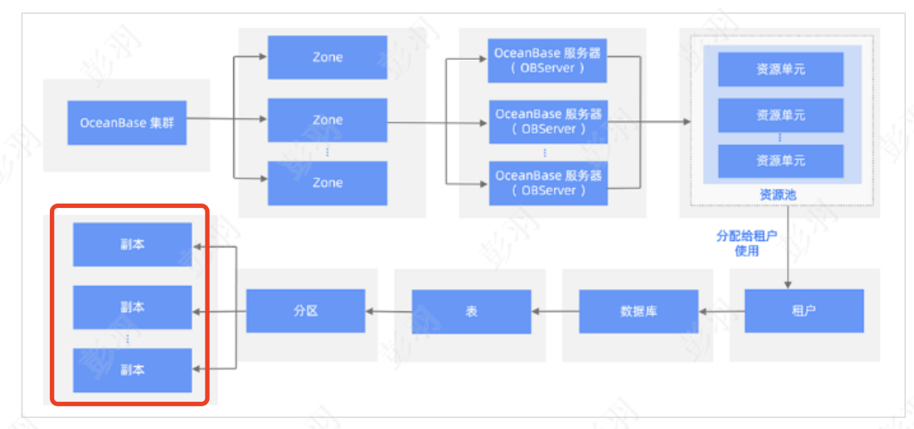
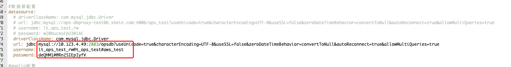

# OceanBase 介绍

## OceanBase 概述

- 高可用

`多副本架构使得城市级故障RPO=0，数据无损。OceanBase主备库特性使得集群间可以数据同步。oms可以使得迁移更加便捷。`

- 高兼容性

对于mysql和oracle数据库生态给予了很好的支持

- 多租户

单集群下可以为不同租户提供服务，充分利用服务性能

- 高性能

基于lsm-tree结构的存储引擎使得读写超越关系型数据库

- 透明可扩展

OceanBase特色的总控服务和分区负载均衡使得系统具有极强的可扩展性，可以在线扩缩容，扩缩容后自动实现负载

- 分布式事务引擎

支持事务ACID属性，并且支持强一致性

- 混合事物和分析处理

分布式计算引擎可以充分利用多个节点计算能力，完成对OLTP和OLAP应用的支持

**2.**  **系统概述**

**3. **** MySql ****兼容性对比**

- 数据类型

不支持空间数据类型

- SQL语法

不支持 SELECT … FOR SHARE …

- 字符集和字符序

支持现在线上使用字符集

- 函数

ob不支持的函数在OPS中不涉及使用

- 分区支持

ob二级分区类型支持优于mysql

- 存储引擎

基于lsm-tree架构的存储引擎

**二、**** OceanBase ****架构**

**1**** ．整体架构**

1. **1.**  **OBServer**

每个节点会运行一个或多个observer的服务进程，每个服务负责自己所在节点上分区数据的存取，也负责路由到本机SQL语句的解析执行，通过TCP/IP 协议通信，同时每个服务与外部应用建立连接提供服务

**1. 2.**  **RootService**

- 资源管理

Region/Zone/Observer/Resource Pool/Unit等元信息管理，比如上下线OBServer，改变tenant资源规格等等

- 负载均衡

决定Unit/Partition在多个机器间的分布，均衡机器间主分区个数，在容灾场景还可以补充缺失Replica

- Schema管理

负责处理DDL请求并生成新Schema

**1. 3.**  **PartiotionService**

分区服务用于负责每个OBServer上各个分区的管理和操作功能的模块，这个模块与事务引擎和存储引擎存在很多调用关系

**1. 4.**  **Paxos**** 组**

- OB基于Paxos的分布式选举算法实现系统高可用，最小力度可以做到分区级别
- 主副分区通过multi-paxos分布式共识协议进行日志同步实现数据一致性，分区和副本构成独立的Paxos复制组，主分区分布在不同Observer上可以实现多点写入

**1. 5.**  **存储引擎（**** LSM-Tree ****）**** Log Structured Merge Tree**

**简介**

增量数据存放在内存(MemTable)，基线数据存放在磁盘(SSTable)。

内存达到阈值会转储SSTable

最终和基线SSTable(ROS) 合并

**插入**** / ****更新****/ ****删除**** / ****查询**

- 插入

1. 写入内存树，同时会更新支撑的数据结构，如行缓存级别布隆过滤器和稀疏索引
2. 内存树超过阈值，会将内存树数据按照顺序刷到转储SSTable

- 更新

1. 通过行缓存查询对应数据，更新数据刷到内存树
2. 行缓存不存在，查询块缓存 -\&gt; 转储SSTable -\&gt; 基线SSTable，load到内存更新

- 删除

1、将删除数据标记为墓碑数据，最终转储到基线SSTable，压实后可以将此内存区域清空

- 查询

1、通过布隆过滤器查询行缓存，存在直接查询行缓存，不存在查询内存树和块缓存，仍不存在查询基线SSTable

**1. 6**** ． ****SQL**** 引擎**

- 解析器

解析成语法树，转换成数据库对应的对象（库/表/列/索引等），将SQL改写为另一条等价SQL以便生成最优执行计划

- 优化器

为SQL请求生成最佳的执行计划，综合SQL语义、对象数据特征、对象物理分布多方因素，解决访问路径选择、联接算法选择、分布式计划生成等多个核心问题，最终选择一个对应该SQL最佳执行计划

- 执行器

对于本地执行计划，Executor会简单的从执行计划的顶端算子调用，由算子自身逻辑完成执行过程，并返回执行结果，对于远程或分布式计划，Executor需要根据预选的划分，将执行树分成多个调度的线程，并通过RPC将其发送给相关的节点执行。执行计划的生成耗时较长，尤其OLTP场景，为了加速SQL请求处理过程，会缓存SQL第一次生成的执行计划缓在内存反复执行。

**2.**  **多租户架构**

**i.**  **概述**

租户既是数据库对象的容器，又是资源（CPU/Memory/IO）的容器。

**ii.**  **系统租户**

管理所有普通租户

**iii.**  **普通租户**

可以看作是一个数据库实例

**iv.**  **租户与资源管理**

- 租户的资源管理

1. 创建资源配置
2. 创建资源池并指定资源池在zone上的分配
3. 创建用户绑定资源池，一个资源池仅属于一个用户，一个用户可以有多个资源池但是在同一个zone下仅允许存在一个资源池

- 如何做到资源隔离

非容器化技术，通过控制资源单元实现

1. 内存完全隔离
2. CPU不完全隔离
3. 事务相关数据结构是分离的
4. Clog共享

大查询策略：大查询最多占用百分之30woker线程，挂起大查询优先小查询，开一个新的worker线程，必须小于最大线程数阈值。

风险：大查询执行比预期时间长

**3**** ．数据库对象**

**表**

**i. **** 表概述**

自增列：

- 多分区唯一
- 语句内递增
- 生成自增列值大于用户显示插入的值

**ii. **** 分区表**

分区表有别于普通表，普通表不支持添加分区。分区表每个分区维护一套自己的SSTable。

**iii. **** 表组**

分区方式相同且放在同一个分区的不同表组成的组

分区表放在同一台Observer上可以减少跨机器通信，减少分布式事务带来的成本

**索引**

**i. **** 简介**

可用性：drop partition后索引为不可用状态，同时DML操作也无需维护索引

可见性：索引设置为不可见时优化器会忽略，DML时需维护索引，可删除索引时设置以观察业务

**ii. **** 局部索引（ ****LOCAL**** ）与全局索引（默认）**

局部索引：单分区内索引，每个分区维护一套

全局索引：

- 全局非分区索引：多分区维系一套索引，索引可能会映射到多个分区

- 全局分区索引：索引通过hash或者list分散到不同分区，索引与数据分区策略不同，所以多个分区都要查

全局索引使用场景：

1. 需要用全局唯一索引
2. 业务的查询无法得到分区键的条件谓词，且业务表没有高并发的同时写入，为避免进行全分区的扫描，可以根据查询条件构建全局索引，必要时可以将全局索引按照新的分区键来分区。

**iii.**  **唯一索引和非唯一索引**

唯一索引：索引表通过指定列和可变主表主键列

非唯一索引：索引表通过指定的索引列和主表主键

**iv. **** 索引使用**

OceanBase 数据库查询索引表数据的完整过程如下：

在 MemTable 中查询数据。

在 SSTable 中查询数据。

将 MemTable 和 SSTable 中的数据融合，得到完整的行。

**分区**

**i. **** 分区键**

一个列或多个列的集合

**ii. **** 分区类型**

分区策略：

Range/List/Hash

每级分区一种分配方法

- Range分区

仅支持一列且需返回INT类型

- Hash分区/Key分区

表达式仅支持返回INT类型，

Hash分区在OLTP场景更优

KEY分区只能是列或不指定，不限于INT

- List分区

仅支持List类型

- 组合分区

**iii. **** 分区索引**

- 局部前缀

通过局部前缀索引定位到分区键对应的唯一一个索引分区，减少索引分区访问量

- 局部非前缀

无法通过分区键定位到一个分区，需要多分区均做查询

- 全局前缀

如果全局分区索引的分区键是索引键的左前缀，那么这个索引称为全局前缀索引。

全局前缀索引可以是唯一索引或者非唯一索引。

全局前缀索引只在用 Range 分区时有意义，对于 Hash 分区索引无意义。原因在于，如果是用户选择 Hash 分区索引，那么用户查询模式一定是指定索引键的点查询，索引键如果覆盖分区键的话，那么是否为前缀索引并无意义，都能够通过用户指定的索引键值算出索引分区；如果用户没有指定全部分区键值，Hash 分区索引则需要访问所有的分区数据，而 Range 分区可以进行一定程度的分区裁剪。

- 全局非前缀

OceanBase 数据库不支持全局非前缀索引，全局非前缀索引对于查询优化并没有太多意义。

例如，表 A 上有一个全局索引 idx(c1,c2)，idx 通过 c2 进行分区，那么 idx 为一个非全局索引。这种情况下，只有当用户指定全部索引键值的时候才能进行分区裁剪，其他情况均需要扫描所有的索引分区，因此用户没有理由不直接用 c1 键做分区，使用 c1 还能通过前缀过滤进行分区裁剪

唯一索引

**4**** ．分布式数据库对象**

**4.1**  **集群架构**

OceanBase 为了数据安全和提供高可用的数据服务，每个分区数据在物理上存储多份，每一份就是分区的一个副本。

分区副本包括存储在磁盘上的静态数据（ SSTable ）、存储在内存的增量数据（ MEMTable）、以及记录事务的日志三类主要的数据。

 

当前，OceanBase 数据库支持以下四种类型的副本：

- 全能型副本（FULL/F）
- 日志型副本（LOGONLY/L）
- 加密投票型副本（ENCRYPTVOTE/E）
- 只读型副本（READONLY/R）

**4.2**  **数据分区和分区副本**

支持分区裁剪和分区感知 JOIN。如果分区个数过少，会导致资源不足，扩容复杂；当分区个数过多，可能会导致分布式查询过多，消耗资源。

**4.3**  **动态扩容和缩容**

弹性扩缩容分为垂直扩容，水平扩缩容和按需预扩缩容。垂直扩容可以在线替换节点，动态调整 UNIT 规格。水平扩缩容可以动态添加删除节点，动态调整租户 UNIT 数量，支持自动负载均衡。按需扩缩容能够快速可靠弹入弹出，主要用于大促如黑五、斋月等资源短期扩容场景。

**5.**  **事务管理**

**5.1**  **事务简介**

**5.2**  **事物结构**

**5.3**  **语句级原子性**

**5.4**  **全局时间戳**

**5.5**  **事务控制**

**5.6 Redo**** 日志**

**5.7**  **本地事务**

**5.8**  **分布式事务**

**5.9 XA**** 事务**

**5.10**  **事务并发和一致性**

**三、实操**

1. docker exec -it obstandalone bash
2. obclient -h 127.0.0.1 -P 2881 -u root@sys -p -c -A oceanbase #密码默认为空#登陆管理员账号
3. select tenant\_name from \_\_all\_tenant; # 查看租户配置

select name from \_\_all\_resource\_pool;

select name from \_\_all\_unit\_config;

1. drop tenant obmysql force; #删除租户配置

drop resource pool obmysql;

drop resource unit obmysql;

1. select unit\_config\_id, name from \_\_all\_unit\_config; #查看当前资源规格及资源池配置

select resource\_pool\_id, name from \_\_all\_resource\_pool;

1. create resource unit my\_unit1 max\_cpu=1, max\_memory=&#39;1g&#39;, max\_iops=128, max\_disk\_size=&#39;5g&#39;, max\_session\_num=64, min\_cpu=1, min\_memory=&#39;1g&#39;, min\_iops=128; # 创建资源单元

create resource pool my\_pool1 unit=&#39;my\_unit1&#39;, unit\_num=1, zone\_list=(&#39;zone1&#39;); #创建资源池

1. create tenant my\_tenant1 resource\_pool\_list=(&#39;my\_pool1&#39;); #创建租户
2. obclient -h 127.0.0.1 -P 2881 -u root@my\_tenant1 -p -c -A oceanbase #登陆租户
3. create database demodb; #创建数据库
4. create table t1(id int(4) primary key, name varchar(20)); #创建表
5. insert into t1(id, name) values (1,&#39;zhangsan&#39;);

select \* from t1; #操作表

**迁移问题**

1. **批量插入是否主键**** id ****不对应问题（待确认）**

mybatis主键获取策略参照MapperMethod，非mybatis生成，根据服务器返回每行二进制rowdata获取

1. **扫描是否出现漏扫问题**

1. **热切方案**
