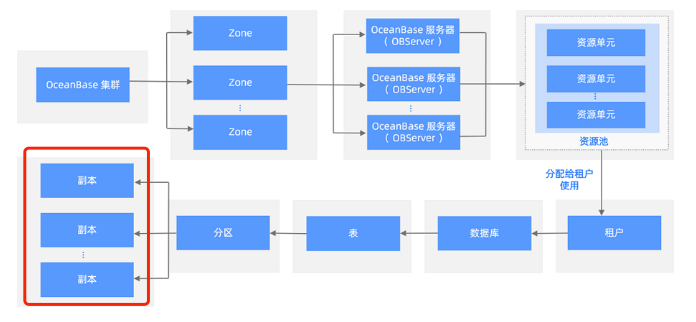

- 高可用

> 多副本架构使得城市级故障RPO=0，数据无损。OceanBase主备库特性使得集群间可以数据同步。oms可以使得迁移更加便捷

- 高兼容性

> 对于mysql和oracle数据库生态给予了很好的支持

- 多租户

> 单集群下可以为不同租户提供服务，充分利用服务性能

- 高性能

> 基于lsm-tree结构的存储引擎使得读写超越关系型数据库

- 透明可扩展

> OceanBase特色的总控服务和分区负载均衡使得系统具有极强的可扩展性，可以在线扩缩容，扩缩容后自动实现负载

- 分布式事务引擎

> 支持事务ACID属性，并且支持强一致性

- 混合事物和分析处理

> 分布式计算引擎可以充分利用多个节点计算能力，完成对OLTP和OLAP应用的支持
