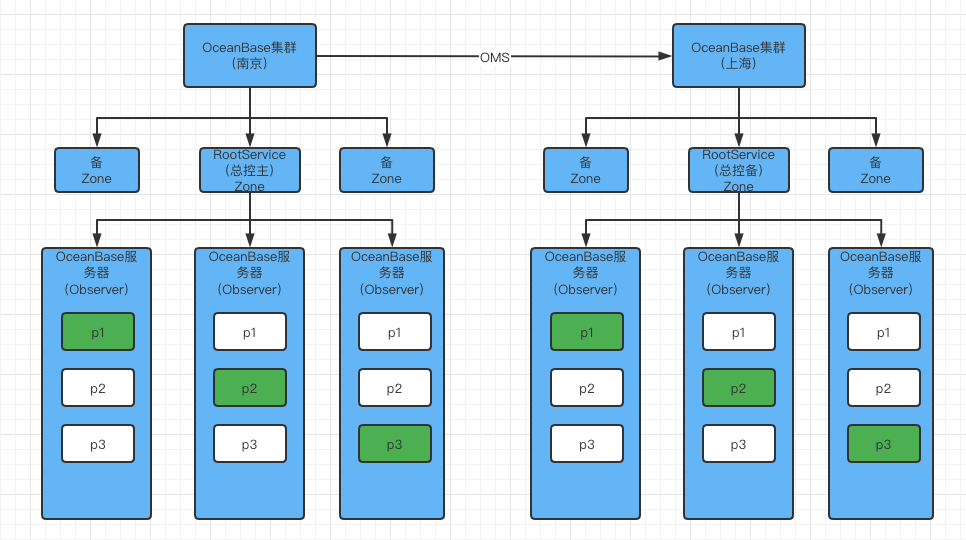

> OceanBase是 100% 完全自主研发的分布式数据库，连续9年稳定支撑双十一， 是全球唯一在 TPC-C 和 TPC-H 测试上都刷新了世界纪录的国产原生分布式数据库。
自研架构，兼顾分布式架构的扩展性与集中式架构的性能优势，OceanBase仅用一套引擎同时支持 TP(事务型) 和 AP(查询分析型) 的混合负载，具有
高可用、高度兼容SQL标准和主流关系数据库、多租户、高性能、透明可扩展、高性价比等特点

## 核心特性
- 高可用

> 多副本架构让整个系统没有任何单点故障，城市级故障RPO=0，RTO < 30秒，OceanBase主备库特性使得集群间可以发送事务日志实现数据同步。

- 高兼容性

> 对于mysql和oracle数据库生态给予了很好的支持

- 多租户

> 单集群下可以为不同租户提供服务，充分利用服务性能

 

- 高性能

> 基于lsm-tree结构的存储引擎使得读写超越关系型数据库

- 透明可扩展

> OceanBase特色的总控服务和分区负载均衡使得系统具有极强的可扩展性，可以在线扩缩容，扩缩容后自动实现负载

- 分布式事务引擎

> 支持事务ACID属性，并且支持强一致性

- 混合事物和分析处理

> 分布式计算引擎可以充分利用多个节点计算能力，完成对OLTP和OLAP应用的支持
