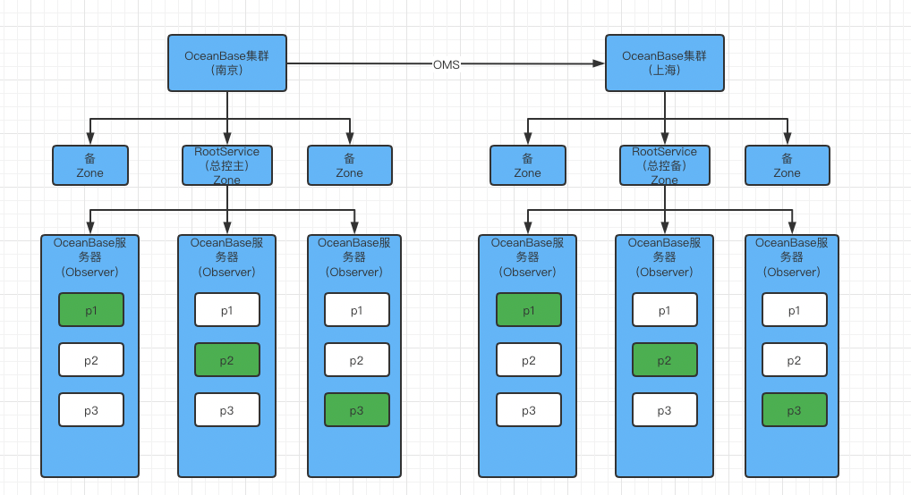

## 1 OBServer

> 每个节点会运行一个或多个observer的服务进程，每个服务负责自己所在节点上分区数据的存取，也负责路由到本机SQL语句的解析执行，通过TCP/IP 协议通信，同时每个服务与外部应用建立连接提供服务

## 2 RootService

- 资源管理

> Region/Zone/Observer/Resource Pool/Unit等元信息管理，比如上下线OBServer，改变tenant资源规格等等

- 负载均衡

> 决定Unit/Partition在多个机器间的分布，均衡机器间主分区个数，在容灾场景还可以补充缺失Replica

- Schema管理

> 负责处理DDL请求并生成新Schema

## 3 PartiotionService

> 分区服务用于负责每个OBServer上各个分区的管理和操作功能的模块，这个模块与事务引擎和存储引擎存在很多调用关系

## 4 Paxos组

- OB基于Paxos的`分布式选举算法`实现系统高可用，最小力度可以做到分区级别
- 主副分区通过`multi-paxos分布式共识协议`进行日志同步实现数据一致性，分区和副本构成独立的Paxos复制组，主分区分布在不同Observer上可以实现多点写入

## 5 存储引擎（LSM-Tree）Log Structured Merge Tree

> 注: 增量数据存放在内存(MemTable)，基线数据存放在磁盘(SSTable)。
内存达到阈值会转储SSTable
最终和基线SSTable(ROS) 合并

### DML

#### 插入

- 写入内存树，同时会更新支撑的数据结构，如行缓存级别布隆过滤器和稀疏索引
- 内存树超过阈值，会将内存树数据按照顺序刷到转储SSTable

#### 更新

- 通过行缓存查询对应数据，更新数据刷到内存树
- 行缓存不存在，查询块缓存 -> 转储SSTable -> 基线SSTable，load到内存更新

#### 删除

- 将删除数据标记为墓碑数据，最终转储到基线SSTable，压实后可以将此内存区域清空

#### 查询

- 通过布隆过滤器查询行缓存，存在直接查询行缓存，不存在查询内存树和块缓存，仍不存在查询基线SSTable