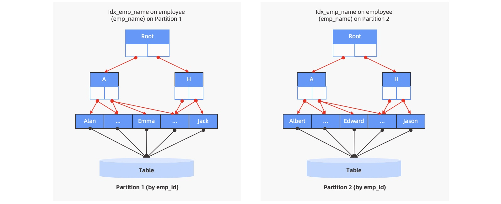
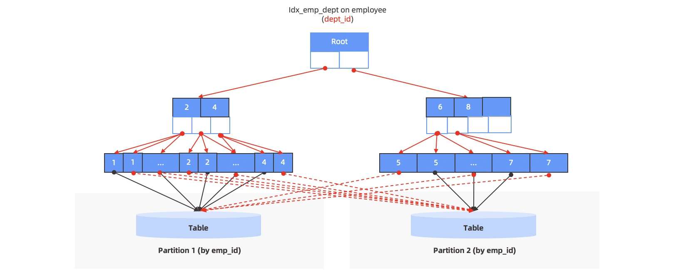
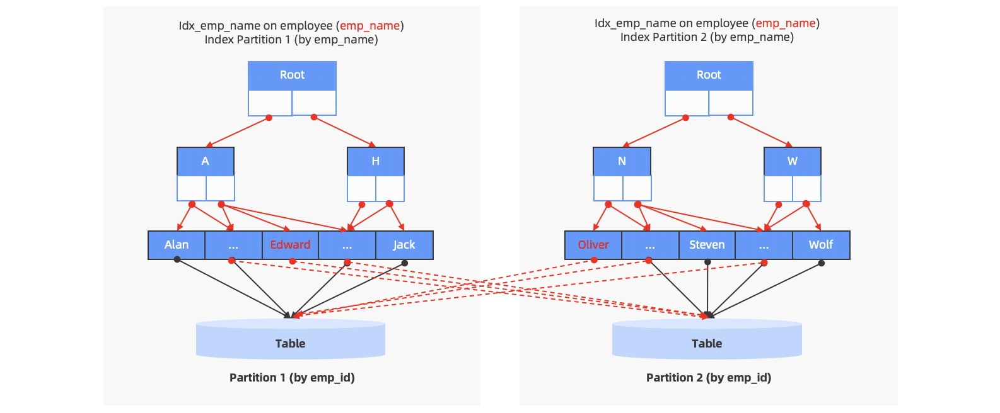

## 索引简介

根据自身业务的需求来决定在某些字段创建索引，从而加快在这些字段的查询速度

**`使用索引`:**

- 加速查询
- 索引存储的列数通常较少，可以节省查询 IO

**`but:`**

- 当`业务发生变化`时，需要重新评估以前创建的索引是否满足需求。
- 写入数据时，需要`维护索引表`中的数据，消耗一定的性能代价。
- 索引表会占用`内存、磁盘`等资源。

## 设计原则

- 最适合索引的列是出现在 `WHERE 子句`中的列，或连接子句中指定的列。
- 使用`惟一索引`。考虑某列中值的分布。索引的列的基数越大，索引的效果越好。
- 使用短索引。如果对字符串列进行索引，应该指定一个前缀长度，只要有可能就应该这样做。
- 利用最左前缀。 在创建一个 n 列的索引时， 实际是创建了 MySQL 可利用的 n 个索引。多列索引可起几个索引的作用， 因为可利用索引中最左边的列集来匹配行。 这样的列集称为最左前缀。
- 不要过度索引。每个额外的索引都要占用额外的磁盘空间， 并降低写操作的性能。 在修改表的内容时， 索引必须进行更新，有时可能需要重构，因此，索引越多，所花的时间越长。
- 对于 InnoDB 存储引擎的表，尽量自己指定主键。InnoDB 表的普通索引都会保存主键的键值，所以主键要尽可能选择较短的数据类型， 可以有效地减少索引的磁盘占用， 提高索引的缓存效果。

## BTREE 索引与 HASH 索引

MEMORY 存储引擎的表可以选择使用 `BTREE索引`或者 `HASH索引`， 两种不同类型的索引各有其不同的适用范围。

`HASH` 索引有一些重要的特征需要在使用的时候特别注意：

- 只用于使用=或<=>（NULL的安全比较）操作符的等式比较（但是很快）。
- 优化器不能使用 HASH 索引来加速 ORDER BY 操作。
- MySQL 不能确定在两个值之间大约有多少行。 如果将一个 MyISAM 表改为 HASH 索
    引的 MEMORY 表，会影响一些查询的执行效率。
- 只能使用整个关键字来搜索一行。

而对于 `BTREE` 索引， 当使用>、 <、 >=、 <=、 BETWEEN、!=或者<>， 或者 LIKE 'pattern' （其
中'pattern'不以通配符开始）操作符时，都可以使用相关列上的索引。

`IN`范围查询适用于 BTREE 索引和 HASH 索引：

```sql
SELECT * FROM t1 WHERE key_col IN (15,18,20);
```

**InnoDB 和 MyISAM 不支持HASH索引类型**，如果指定了使用HASH类型的索引，会被替换为BTREE。

**注意**：如果需要访问大部分行，顺序读取要快得多，因为此时应避免磁盘搜索。

## 局部索引和全局索引

### 局部索引

和非分区表的索引类似，索引的数据结构还是`和主表的数据结构保持一对一的关系`，但由于主表已经做了分区，主表的每一个分区都会有自己单独的索引数据结构。对每一个索引数据结构来说，里面的键（Key）只映射到自己分区中的主表数据，不会映射到其它分区中的主表 `Local Partitioned Index`


`employee` 表按照 `emp_id` 做了 Range 分区，同时也在 `emp_name` 上创建了局部索引。

### 全局索引

分区表的全局索引`不再和主表的分区保持一对一的关系`，而是将所有主表分区的数据合成一个整体来看，索引中的一个键可能会映射到多个主表分区中的数据（当索引键有重复值时）。更进一步，全局索引可以定义自己独立的数据分布模式，既可以选择非分区模式也可以选择分区模式；在分区模式中，分区的方式既可以和主表相同也可以和主表不同。

#### 全局非分区索引（Global Non-Partitioned Index）

索引数据不做分区，保持单一的数据结构，和非分区表的索引类似。但由于主表已经做了分区，因此会出现索引中的某一个键映射到不同主表分区的情况，即一对多的对应关系



#### 全局分区索引（Global Partitioned Index）

索引数据按照指定的方式做分区处理，例如做哈希（Hash）分区或者范围（Range）分区，将索引数据分散到不同的分区中。但索引的分区模式是完全独立的，和主表的分区没有任何关系，因此对于每个索引分区来说，里面的某一个键都可能映射到不同的主表分区（当索引键有重复值时），索引分区和主表分区之间是多对多的对应关系。



`employee` 表按照 `emp_id` 做了 `Range` 分区，同时在 `emp_name` 上做了全局分区索引。可以看到同一个索引分区里的键，会指向不同的主表分区。

由于全局索引的分区模式和主表的分区模式完全没有关系，看上去全局索引更像是另一张独立的表，因此也会将全局索引叫做索引表，理解起来会更容易一些（和主表相对应）。 说明非分区表也可以创建全局分区索引。但如果主表没有分区的必要，通常来说索引也就没有必要分区了。

推荐使用`全局索引`的场景包括：

- 业务上除了主键外，还有其他列的组合需要满足全局唯一性的强需求，这个业务需求仅能通过全局性的唯一索引来实现

- 业务的查询无法得到分区键的条件谓词，且业务表没有高并发的同时写入，为避免进行全分区的扫描，可以根据查询条件构建全局索引，必要时可以将全局索引按照新的分区键来分区
  
全局索引虽然为全局唯一、数据重新分区带来了可能，解决了一些业务需要根据不同维度进行查询的强需求，但是为此付出的代价是每一笔数据的写入都有可能变成跨机的分布式事务，在高并发的写入场景下它将影响系统的写入性能。当业务的查询可以拥有分区键的条件谓词时，OceanBase 数据库依旧推荐构建局部索引，通过数据库优化器的分区裁剪功能，排除掉不符合条件的分区。这样的做法可以同时兼顾查询和写入的性能，让系统的总体性能表现更优。

## 唯一索引和非唯一索引

索引表分为唯一索引和非唯一索引，其中唯一索引保证在表内的索引列上不存在两行有完全相同的值，而非唯一索引则可能存在完全相同的值。在 OceanBase 数据库中，NULL 值也会存储在索引中。

​对于非唯一索引，索引表的存储键是用户指定的索引列和主表主键；而对于唯一索引列，索引表的存储键是用户指定的索引列和可变的主表主键列，这里可变的含义是主键列的值是随索引列值的不同而不同。

如下例所示，对于非唯一索引表 i1，它的存储键是 c2 和 c1，而对于唯一索引表 i2，它的存储键是 c2，而 c1 是可变的。当 c2 为 NULL 时，可变的 c1 列值是主表 c1 列的值；当 c2 不为 NULL 时，可变的 c1 列值为 NULL。

```sql
CREATE TABLE t1(c1 INT, c2 INT, c3 INT, c4 INT, PRIMARY KEY(c1));
CREATE INDEX i1 ON t1(c2);
CREATE UNIQUE INDEX i2 ON t1(c3);
```

## 索引的使用

当用户创建好索引后，OceanBase 数据库会自动维护该索引，所有的 DML 操作都会实时更新索引表相应的数据记录，同时优化器也会根据用户的查询来自动地选择是否使用索引。本文主要介绍如何进行索引扫描。

当 SQL 查询语句指定谓词条件查询的是索引列时，数据库会自动地抽取谓词条件作为查询索引的范围，也就是查询索引表的起始键和终止键。数据库根据起始键能定位到数据开始的位置，根据终止键能定位出数据结束位置，而开始和结束位置范围内所包含的数据是需要被此查询扫描的数据。

​对于索引表，OceanBase 数据库存储时使用 MemTable`内存` 和 SSTable`磁盘` 来存储数据，其中 MemTable 使用的是B+ 树结构，而 SSTable 使用的是宏块结构。在 MemTable 或者 SSTable 都按照上述扫描过程，扫描出相应的数据，而最终的数据行是由 MemTable 和 SSTable 的数据行融合成完整的数据行。

因此，`OB`查询索引表数据的完整过程如下：

- 在 MemTable 中查询数据。
- 在 SSTable 中查询数据。
- 将 MemTable 和 SSTable 中的数据融合，得到完整的行。

​当 SQL 查询语句只涉及到索引表中的列时，那么数据库会根据用户指定的列，按照上述查询过程，查询相应索引表的 MemTable 和 SSTable，得到完整的数据行。

​当 SQL 查询语句除了包含索引表中的列，还包含其他列时，数据库会先通过索引表，查询出相关的行，并根据行上的主键，按照上述查询过程，到主表中查询所需要的数据列`回表`。

## 索引的存储

`OB`中，索引表的存储类似于普通的数据表，其数据也是存储在宏块和微块的结构中。由于 `OB`使用的是聚集索引表模型，因此在索引的行中除了用户指定的索引列之外，还会存储主表的主键列，以方便进行回表。
