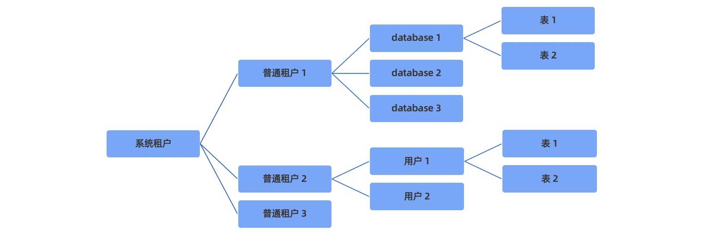

## 1 概述

`租户既是数据库对象的容器，又是资源（CPU/Memory/IO）的容器` 

---

## 2 系统租户

管理员：`管理所有普通租户`

---

## 3 普通租户

逻辑上 = `mysql server`

- 可以创建自己的用户
- 可以创建数据库（database）、表（table）等所有客体对象
- 有自己独立的系统表和系统视图
- 有自己独立的系统变量
- 数据库实例所具备的其他特性

所有用户数据的元信息都存储在普通租户下，租户**彼此隔离不可访问**


---

## 4 租户与资源管理

`OB` 一个集群内可包含多个相互独立的租户 

### 租户资源的创建

创建租户前，需首先确定**租户的资源配置、使用资源范围**等。租户创建的通用流程如下：

1. 创建资源配置 `用来描述资源池中每个资源单元可用的 CPU、内存、存储空间和 IOPS 等的规格`
2. 创建资源池 `资源池由若干个资源单元组成，通过给资源池指定资源配置，可指定资源池下各资源单元的物理资源`
3. 创建租户 `一个资源池仅能属于一个租户，一个租户可拥有一个或多个资源池，租户在同一个 Zone 上仅能有一个资源池`

### 租户资源的变更

**修改资源配置** `直接调整资源配置的 CPU 或 Memory 等的值，进而直接影响租户在该资源池上的资源规格和服务能力`

```sql
obclient> CREATE RESOURCE UNIT uc1 MAX_CPU 5, MIN_CPU 4, MAX_MEMORY '36G', MIN_MEMORY '32G', MAX_IOPS 128, MIN_IOPS 128, MAX_DISK_SIZE '2T', MAX_SESSION_NUM 64;
obclient> CREATE RESOURCE POOL pool1 UNIT 'uc1', UNIT_NUM 2, ZONE_LIST ('z1', 'z2');
obclient> CREATE RESOURCE POOL pool2 UNIT 'uc1', UNIT_NUM 1, ZONE_LIST ('z3');
obclient> CREATE TENANT tt resource_pool_list=('pool1','pool2');
obclient> ALTER RESOURCE UNIT uc1 MAX_CPU 6, MIN_MEMORY '36G';
```

**切换资源配置** `调整资源池下每个资源单元的资源规格，进而调整租户在该资源池上的资源规格和服务能力`

```sql
obclient> ALTER RESOURCE POOL rp1 UNIT 'uc2';
```

**变更 UNIT_NUM** `调整资源池的 UNIT_NUM 可以调整资源池下每个 Zone 内资源单元的数量，进而通过调整资源单元的数量来提高或降低该租户在对应 Zone 上的服务能力`

```sql
obclient> CREATE RESOURCE POOL rp1 UNIT 'uc1', UNIT_NUM 2, ZONE_LIST ('zone1', 'zone2');
obclient> ALTER RESOURCE POOL rp1 UNIT_NUM 3; // 调大unit num
obclient> ALTER RESOURCE POOL rp1 UNIT_NUM 2; // 调小unit num
obclient> ALTER RESOURCE POOL rp1 UNIT_NUM 1 DELETE UNIT = (1001, 1003); // 指定资源单元调小unit num
```

**变更 ZONE_LIST** `调整资源池的 ZONE_LIST 可以调整资源池在 Zone 维度的使用范围，从而调整租户数据在 Zone 维度的服务范围`

```sql
obclient> CREATE RESOURCE POOL pool1 UNIT_NUM=3, UNIT='unit_config', ZONE_LIST=('z1','z2','z3');
obclient> CREATE RESOURCE POOL pool2 UNIT_NUM=3, UNIT='unit_config', ZONE_LIST=('z1','z2','z3');
obclient> ALTER RESOURCE POOL pool1 ZONE_LIST=('z1','z2','z3','z4');
obclient> ALTER RESOURCE POOL pool2 ZONE_LIST=('z1','z2');
```

**分裂资源池** 

```sql
obclient> CREATE RESOURCE POOL pool1 UNIT='uc0', UNIT_NUM=1, ZONE_LIST=('z1','z2','z3');
obclient> ALTER RESOURCE POOL pool1 SPLIT INTO ('pool10','pool11','pool12') ON ('z1','z2','z3');
obclient> ALTER RESOURCE POOL pool10 UNIT='uc1';
obclient> ALTER RESOURCE POOL pool11 UNIT='uc2';
obclient> ALTER RESOURCE POOL pool12 UNIT='uc3';
```

**合并资源池**

```sql
obclient> CREATE RESOURCE POOL pool1 UNIT='uc0', UNIT_NUM=1, ZONE_LIST=('z1');
obclient> CREATE RESOURCE POOL pool2 UNIT='uc0', UNIT_NUM=1, ZONE_LIST=('z2');
obclient> CREATE RESOURCE POOL pool3 UNIT='uc0', UNIT_NUM=1, ZONE_LIST=('z3');
obclient> ALTER RESOURCE POOL MERGE ('pool1','pool2','pool3') INTO ('pool0');
```

---

## 5 租户间的资源隔离

为了确保租户间不出现资源争抢保障业务稳定运行，`OB`针对租户间的资源进行了隔离。

`OB` 中把 Unit 当作给租户分配资源的基本单位，一个 Unit 可以类比于一个 Docker 容器。一个 OBServer 上可以创建多个 Unit，在 OBServer上每创建一个 Unit 都会占用一部分该 OBServer 的 CPU、内存等物理资源。

一个租户可以在多个 OBServer上放置多个 Unit，但一个特定的租户在某个 OBServer 上只能有一个 Unit。一个租户的多个 Unit 相互独立，OceanBase 数据库目前没有汇总多个 Unit 的资源占用进行全局的资源控制, 具体来讲，不会因为一个租户在某个 OBServer 上的资源没得到满足，就让它在另一个 OBServer 上去抢其它租户的资源。

所谓资源隔离，就是 OBServer 控制本地多个 Unit 间的资源分配的行为, 它是 OBServer 本地的行为。

**普通用户的视角看隔离效果**

> **内存完全隔离**

SQL 执行过程各种算子使用的内存是分离的，一个租户的内存耗尽不会影响到另一个租户。
Block Cache 和 MEMTable 是分离的，一个租户的内存耗尽不会影响到另一个租户的写入和读取。

> **CPU 通过用户态调度实现隔离**

一个租户能使用的 CPU 资源是由 Unit 规格决定的，不过 OBServer 目前是允许租户 CPU 超卖的。

> **大部分数据结构是分离的**

SQL 的 Plan Cache 是租户分离的，一个租户的 Plan Cache 淘汰不会影响另一个租户。
SQL 的 Audit 表是分离的，一个租户的 QPS 太高，不会冲洗掉另一个租户的 Audit 信息。
事务相关的数据结构是分离的。具体包括：

- 一个租户的行锁挂起，不会影响到其他租户
- 一个租户的事务挂起，不会影响到其他租户
- 一个租户的回放出问题，不会影响到其它租户

> **Clog 是共享的**

一个 OBServer 上的不同租户共享 Clog 文件，这个设计主要是为了让事务的 Group Commit 能有更好的效果
