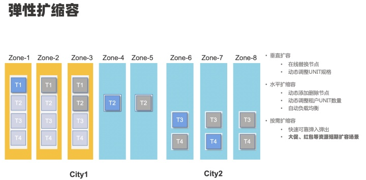

## 分布式数据库对象

### 基本概念

`什么是数据库对象`

数据库对象是数据库的组成部分，是指在数据库中可以通过 SQL 进行操作和使用的对象。

`分布式数据库对象`  
相较于传统集中式数据库对象,分布式数据库对象可扩展性更高

        OceanBase数据库将一些数据库对象的数据存储在一个或者多个SSTable中.
        一个SSTable包含一个或多个宏块，每个宏块中包含一个或多个微块，每个微块包含一行或者多行。有些数据库对象（例如视图）由于只有元数据信息，所以不会存储实际的数据。
        不同于一些传统数据库，OceanBase 数据库的表空间是系统自动管理的，用户不需要显式创建和管理表空间。一些功能支持表空间的语法(例如使用透明加密功能时)允许用户设置表空间相关的属性。

`OceanBase分布式数据库架构特点`
- 具备基于原生分布式的水平扩展能力
- 采用基于无共享集群的分布式架构
- 通过 Paxos 共识协议实现数据多副本的一致性

### 集群架构

- 集群

>`OceanBase `数据库集群由一个或多个`Region`组成，`Region`由一个或多个`Zone`组成,`Zone`由一个或多个`OBServer`组成，每个`OBServer`有若干个`Partition`的`Replica`

- Region

>`Region`对应物理上的一个城市或地域，当`OceanBase`数据库集群由多个`Region`组成时，数据库的数据和服务能力就具备地域级容灾能力；
> 当集群只有一个`Region`时，如果出现整个城市级别的故障，则会影响数据库的数据和服务能力。

- Zone

> Zone一般情况(不考虑机房级容灾可部署一中心三副本)下对应一个有独立网络和供电容灾能力的数据中心
> 在一个`Region`内的多个`Zone `间`OceanBase `数据库集群拥有`Zone `故障时的容灾能力。

- OBServer

> 一台物理机上可以部署一个或者多个`OBServer`(通常情况下一台物理机只部署一个`OBServer`)。
> Server 由其IP地址和服务端口唯一标识。

- Partition

> 以分区(Partition)为单位组织用户数据，分区在不同机器上的数据拷贝称为副本(Replica)。
> 同一分区的多个副本使用Paxos一致性协议保证副本的强一致，每个分区和它的副本构成一个独立的 Paxos 组，其中一个分区为主副本(Leader)，其它分区为从副本(Follower)。
> 主副本具备强一致性读和写能力，从副本具备弱一致性读能力。

- RootService

> 总控服务(RootService)运行在某个OBServer上。当 RootService 所在机器故障时，其余 OBServer 会选举出来新的 RootService。
> RootService 主要提供资源管理、负载均衡、 schema 管理等功能

- Locality

> 租户下分区在各个Zone上的副本类型和副本分布

- PrimaryZone

> 用户可通过一个租户级的配置，使租户下分区 Leader 分布在指定的 Zone 上，此时称 Leader 所在的 Zone 为 PrimaryZone。
> PrimaryZone 是一个 Zone 集合，用分号(;)分割表示不同的优先级，用逗号(,)分隔表示相同的优先级。
> RootService 会根据用户设置的 PrimaryZone，按照优先级高低顺序，尽可能把分区 Leader 调度到更高优先级的 Zone 内，并在同一优先级的 Zone 间将 Leader 打散在不同的机器上。
> 不设置 PrimaryZone 的 场合，会认为租户的所有 Zone 都是同一优先级，RootService 会把租户分区 Leader 打散在所有 Zone 内的 机器。

## 2 数据分区和分区副本
        OceanBase 数据库参考传统数据库分区表的概念，把一张表格的数据划分成不同的分区（Partition）。
        在分布式环境下，为保证数据读写服务的高可用，OceanBase 数据库会把同一个分区的数据拷贝到多个机器。
        不同机器同一个分区的数据拷贝称为副本（Replica）。
        同一分区的多个副本使用 Paxos 一致性协议保证副本的强一致，每个分区和它的副本构成一个独立的 Paxos 组，其中一个分区为主分区（Leader），其它分区为备分区（Follower）。主分区具备强一致性读和写能力，备分区具备弱一致性读能力。

- 分区`Partition`
> 同一张表水平拆分的不同子表称之为分区

- 副本
> 不同机器同一个分区的数据拷贝称为副本`Replica`

- LocationCache
> 分区的位置信息即称为`Location`
> 用于SQL请求执行过程中查询分区的位置信息
> 刷新及缓存本机需要的分区`Location`的服务称之为`LocationCache`

**当前，OceanBase数据库支持以下四种类型的副本**

* 全能型副本(FULL/F)
* 日志型副本(LOGONLY/L)
* 加密投票型副本(ENCRYPTVOTE/E)
* 只读型副本(READONLY/R)

- 分布式一致性协议
> 使用`Paxos协议`在同一分区各副本间同步事务日志，多数派同步成功才能提交

- 数据均衡
  > 最终会使所有机器的各类型资源占用都处于一种比较均衡的状态，充分利用每台机器的所有资源。
    - 副本均衡
    > Unit迁移、副本复制或迁移
    - Leader均衡
    > 在副本均衡的基础上,均衡各机器分区`Leader`的数目

   

> 支持分区裁剪和分区感知JOIN。如果分区个数过少，会导致资源不足，扩容复杂；当分区个数过多，可能会导致分布式查询过多，消耗资源。

## 3 动态扩容和缩容

> 弹性扩缩容分为垂直扩容，水平扩缩容和按需预扩缩容。垂直扩容可以在线替换节点，动态调整 UNIT 规格。水平扩缩容可以动态添加删除节点，动态调整租户 UNIT 数量，支持自动负载均衡。按需扩缩容能够快速可靠弹入弹出，主要用于大促如黑五、斋月等资源短期扩容场景。

