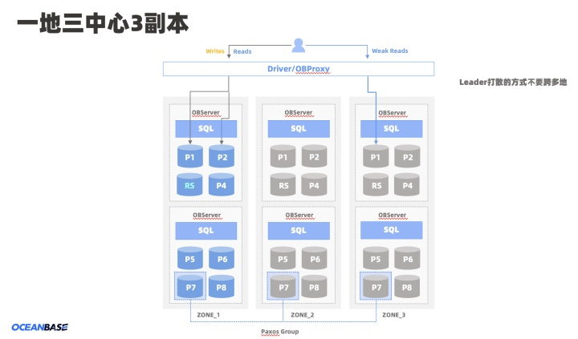
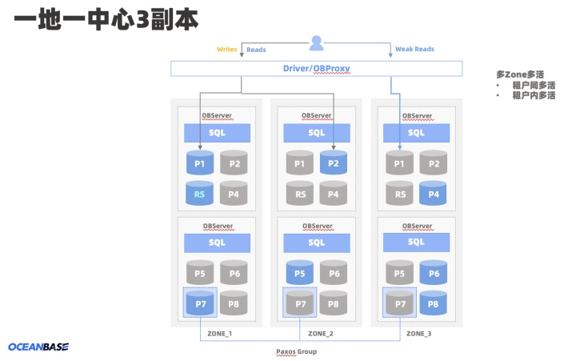
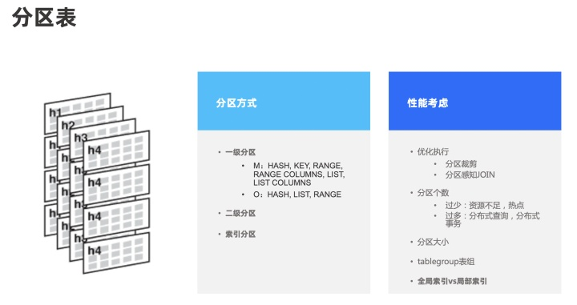
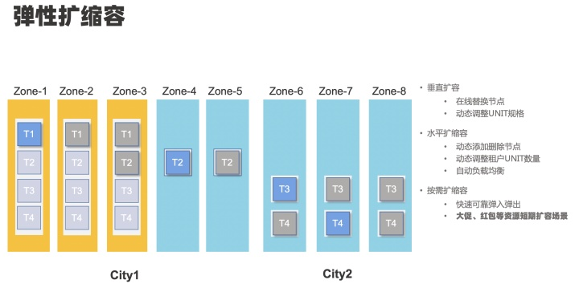

## 1 集群架构

- OceanBase 为了数据安全和提供高可用的数据服务，每个分区数据在物理上存储多份，每一份就是分区的一个副本。
- 分区副本包括存储在磁盘上的静态数据（ SSTable ）、存储在内存的增量数据（ MEMTable）、以及记录事务的日志三类主要的数据。

### 1.1 基本概念

- 集群

> OceanBase 数据库集群由一个或多个 Region 组成，Region 由一个或多个 Zone 组成，Zone 由一个或多个 OBServer 组成，每个 OBServer 有若干个 Partition 的 Replica。

- Region

> Region 对应物理上的一个城市或地域，当 OceanBase 数据库集群由多个 Region 组成时，数据库的数据和服务能力就具备地域级容灾能力；当集群只有一个 Region 时，如果出现整个城市级别的故障，则会影响数据库的数据和服务能力。

- Zone

> Zone 一般情况（不考虑机房级容灾可部署一中心三副本）下对应一个有独立网络和供电容灾能力的数据中心，在一个 Region 内的多个 Zone 间 OceanBase 数据库集群拥有 Zone 故障时的容灾能力。

- OBServer

> 运行 observer 进程的物理机。一台物理机上可以部署一个或者多个 OBServer（通常情况下一台物理机只部署一个 OBServer）。在 OceanBase 数据库内部，Server 由其 IP 地址和服务端口唯一标识。

- Partition

> Oceanbase数据库以分区（Partition）为单位组织用户数据，分区在不同机器上的数据拷贝称为副本（Replica）。同一分区的多个副本使用Paxos一致性协议保证副本的强一致，每个分区和它的副本构成一个独立的 Paxos 组，其中一个分区为主副本（Leader），其它分区为从副本（Follower）。主副本具备强一致性读和写能力，从副本具备弱一致性读能力。

- 当前，OceanBase 数据库支持以下四种类型的副本
  - 全能型副本（FULL/F）
  - 日志型副本（LOGONLY/L）
  - 加密投票型副本（ENCRYPTVOTE/E）
  - 只读型副本（READONLY/R）

## 2 数据分区和分区副本

> 支持分区裁剪和分区感知 JOIN。如果分区个数过少，会导致资源不足，扩容复杂；当分区个数过多，可能会导致分布式查询过多，消耗资源。
> 

## 3 动态扩容和缩容

> 弹性扩缩容分为垂直扩容，水平扩缩容和按需预扩缩容。垂直扩容可以在线替换节点，动态调整 UNIT 规格。水平扩缩容可以动态添加删除节点，动态调整租户 UNIT 数量，支持自动负载均衡。按需扩缩容能够快速可靠弹入弹出，主要用于大促如黑五、斋月等资源短期扩容场景。

