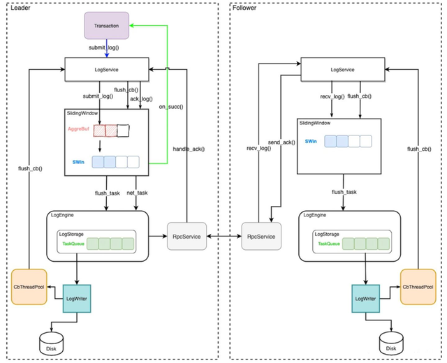
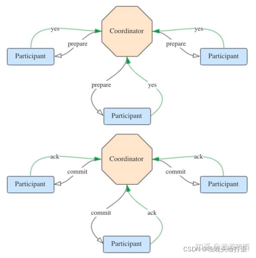
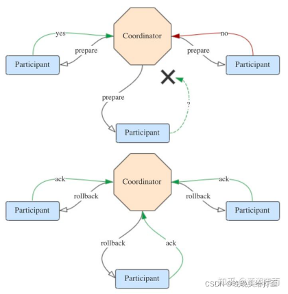
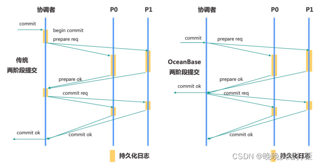

## 1.简介 

---
### 基本概念
- 原子性
>两阶段提交协议保证事务的原子性
- 一致性  
>事务必须是使数据库从一个一致性状态变到另一个一致性状态。一致性与原子性是密切相关的
- 隔离性  
>在MySQL模式下，支持 Read Committed 隔离级别和 Repeatable Read 隔离 级别。
- 持久化  
>redo log记录数据修改,WAL机制保证宕机恢复，paxos保证多副本数据同步

---
### 执行流程
- 创建全局事务ID
- 识别分区数据
- 创建分区对应的上下文(记录修改)
- 等待commit/rollback
- 持久化到clog
- ddl发起隐式commit,断开连接发起隐式rollback

- `以一个分区的一条事务日志为例，正常的流程大致如下:`
- 
- `在 follower 上，会对已提交的日志实时进行回放。回放流程大致如下:`
- 

### 全局时间戳
- 对于用户租户而言，租户级别内部表 __all_dummy 的 leader 作为 GTS 服务提供者，时间来源于该leader的本地时钟。GTS 默认是三副本的，其高可用能力跟普通表的能力一样。
- 对于系统租户，使用 __all_core_table 的 leader 作为 GTS 服务的提供者，高可用能力与普通表一样
- 时间戳正确性保证
   - 有主改选 
     - >原 Leader 主动发起改选的场景，我们称为有主改选。新 leader 上任之前先获取旧 leader 的最大已经授 权的时间戳作为新 leader 时间戳授权的基准值。因此该场景下，GTS 提供的时间戳不会回退。
   - 无主选举
     - >原 leader 与多数派成员发生网络隔离，等 lease 过期之后，原 follower 会重新选主，这一个过程，我们 称为无主选举。选举服务保证了无主选举场景下，新旧 Leader 的 lease 是不重叠的，因此能够保证本地 时钟一定大于旧主提供的最大时间戳。因此新 leader 能够保证 GTS 提供的时间戳不回退。

### 事务控制
- 事务配置
  - 大小
    - 2.x版本上限为100M，3.x不做限制
    - 租户级配置项(优先) _tenant_max_trx_size 、集群级配置项 _max_trx_size
  - 状态
    - 虚拟表 __all_virtual_trans_stat 里的 state 字段标识了事务所处的状态
  - 超时
    - 语句超时时间,系统变量ob_query_timeout,默认为10s
    - 事务超时时间,系统变量ob_trx_timeout,事务超时时需应用主动发起rollback
    - 事务超时自动回滚时间,系统变量 ob_trx_idle_timeout,即session上一个事务处于的 IDLE(空闲) 状态的最长时间
  - Savepoint
    - 事务执行中的保存点，可回滚至保存点

### redo log 
  > 以物理日志的形式记录数据修改历史(操作结果)  

  > 遵循WAL(write-ahead logging)原则, 在事务提交前将 Redo 日志持久化至clog, 用于宕机恢复  

  > 采用 Multi-Paxos 协议 进行多副本同步, 提交事务需要保证redo日志已同步到多数派的副本上时才能成功, 最终会同步到所有副本上
   
### 日志文件
- 简述  `分区级别的日志流,保证有序连续,最终流入日志文件`
- 类型
  - Clog(commit log)  `记录redoLog内容,同步多副本`
  - ilog(index log)   `Clog的索引文件,记录连续递增的Clog文件ID`
- 产生和收集
  > 事务提交时将redolog写入clog,以2MB大小为限制,交予clog同步其余副本(半数以上)  
  > 单条 Redo 日志聚合了多次写操作的内容
- 控制与回收
  > `clog_disk_usage_limit_percentage` 控制Clog或ilog磁盘空间的使用上限  
  > `clog_disk_utilization_threshold`  使用下限
   
### 本地事务概述    
  `指事务所操作的表的分区Leader全部在同一个Server上，并且与Session建立的Server具有相同的事务`
  > 单分区事务  `事务只涉及一个分区, 如同一张表的同一个分区`
  > 单机多分区事务 `事务只涉及多个分区, 如同事务下不同表的操作`
   
### 分布式事务概述  
`事务涉及的分区数量大于一个 或 事务涉及的分区数量只有一个，且分区leader和事务session位置不在同一个server`
### 俩阶段提交(2PC)
`引入一个中心节点统一处理所有节点的执行逻辑，以感知每个节点的事务执行情况。该中心节点称为协调者(coordinator)，被协调者调度的其它节点称为参与者(participant)。
 2PC将分布式事务分成了两个阶段，两个阶段分别为提交请求（投票）和提交（执行）。协调者根据参与者的响应来决定是否需要真正地执行事务。一般地，还有一个预处理阶段，包括获取行锁，生成redo`
>Prepare阶段:  
  1.协调者向所有参与者发送prepare请求与事务内容，询问是否可以准备事务提交，并等待参与者的响应。  
  2.参与者执行事务中包含的操作，并记录undo日志（用于回滚）和redo日志（用于重放），但不真正提交。  
  3.参与者向协调者返回事务操作的执行结果，执行成功返回yes，否则返回no。
> Commit阶段:
  success: 若所有参与者都返回yes，说明事务可以提交：
  1.协调者向所有参与者发送commit请求。
  2.参与者收到commit请求后，将事务真正地提交上去，并释放占用的事务资源，并向协调者返回ack。
  3.协调者收到所有参与者的ack消息，事务成功完成。
   
  failed:
  1.协调者向所有参与者发送rollback请求。
  2.参与者收到rollback请求后，根据undo日志回滚到事务执行前的状态，释放占用的事务资源，并向协调者返回ack。
  3.协调者收到所有参与者的ack消息，事务回滚完成。  
     
  > OceanBase对传统的2PC流程做了优化，传统的两阶段提交的延迟相当于`2次RPC`和`4次写日志`操作。  
  > OceanBase采用协调者无状态设计,协调者不再维护分布式事务的状态  
  > 而是在宕机恢复时,通过所有参与者的局部状态动态构造分布式事务的全局状态。  
  > 避免了协调者写日志，一次两阶段提交的延迟降低到`1次RPC`和`2次写日志`操作。
  > 其流程如下图所示:`
     
> PREPARE阶段   
> 协调者:协调者向所有的参与者发起 prepare request  
> 参与者:参与者收到prepare request之后，决定是否可以提交，如果可以则持久化prepare log并且向协调者返回prepare成功，否则返回prepare失败。  
> COMMIT阶段  
> 协调者:协调者收齐所有参与者的 prepare ack 之后，进入 COMMIT 状态，向用户返回事务 commit 成功， 然后向所有参与者发送事务 commit request。  
> 参与者:参与者收到commit request之后释放资源解行锁，然后提交commit log，日志持久化完成之后给协调者回复commit ok 消息，最后释放事务上下文并退出。

### XA事务(不做赘述可自行了解)