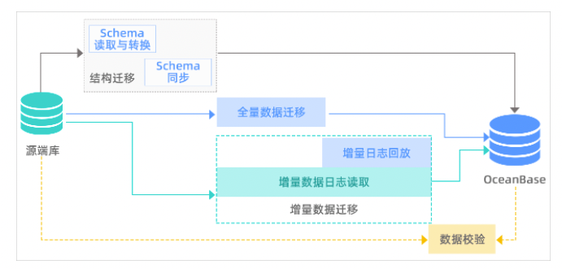

#### 1. 批量插入是否主键id不对应问题（待确认）  
mybatis主键获取策略参照MapperMethod，非mybatis生成，根据服务器返回每行二进制rowdata获取

#### 2. 扫描是否出现漏扫问题
- 2.1 根据lastScanId做limit  
是否可以创建普通表？

- 2.2  根据lastScanId和endId做区间查询  
是否可以创建普通表？

#### 3. 热切方案 

- 3.1 正向迁移  
OMS 提供的不停服数据迁移功能，不影响迁移过程中源数据库持续对外提供服务，能够最小化数据迁移对业务的影响。 在完成结构迁移、全量数据迁移和增量数据迁移后，源数据库的全量和增量数据均已实时同步至目标数据库中， 数据校验通过后，业务可以从源端切换至目标端。

- 3.2 逆向迁移  
应用切到OceanBase之前，OMS可启用反向数据同步链路，此时应用在OceanBase产生的数据变更会实时同步到源端数据库以此来降低迁移风险